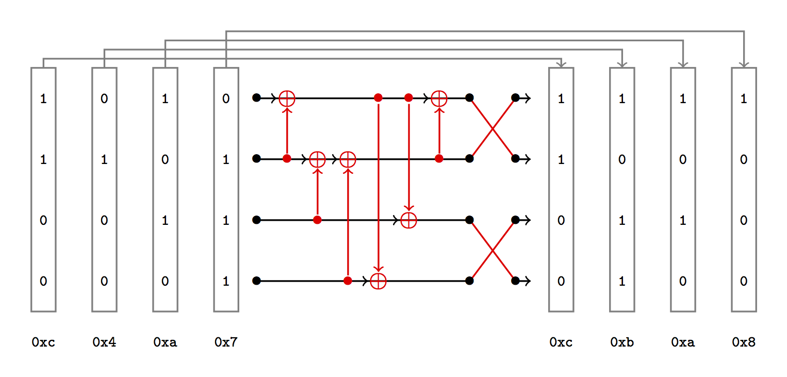

# Xoring Networks

In this challenge, we propose to adopt the representation used in [Sorting Networks](https://en.wikipedia.org/wiki/Sorting_network) to introduce **Xoring Networks**.

A Xoring Network of dimension `n` is a composed of

* `n` wires, each holding one bit (`0` or `1`),
* `m` XOR gates within the `n` wires,
* a final permutation `P` of the `n` wires.

**Goal.**
The goal of the Xoring Network of dimension `n` denoted `XN[n, A, B]` is to transform the sequence `A` of `n`-bit input values `a_i` into the sequence `B` of `n`-bit output values `b_i`. 
That is, for all `i`, `XN[n, A, B](a_i) = b_i`.

**Problem.** 
On inputs `A` and `B`, the **Xoring Network Problem** (XNP) asks to find a Xoring Network that transforms sequence `A = (a_i)` into sequence `B = (b_i)` using **at most** `M` XOR gates. The associated decision problem **DXNP** asks whether a solution exists.

**Note.** Some XNP instances do not admit any solution, but some may have more than one.

**Challenge.**
In this challenge, you will be asked to find solution for several XNP instances of increasing dimensions.

## Format on an example

We now give the textual description for an XNP instance and the expected format for a corresponding solution.

Consider the XNP instance given by

```
--------- BEGIN XNP ---------
4
6
0xc 0xc
0x4 0xb
0xa 0xa
0x7 0x8
---------- END XNP ----------
```

where :

* the first line contains `n` (here, `n = 4`),
* the second line contains `M` (here, `M = 6`),
* the remaining `n` lines contain each pair `(a_i, b_i)` of the sequences `A` and `B`. Here, `(a_0, b_0) = (0xc, 0xc)`, `(a_1, b_1) = (0x4, 0xb)`, etc.

This XNP instance example can be represented by this figure:


A **solution** of this XNP instance is represented in this figure:



This solution is described in textual form as:

```
----- BEGIN XNP SOLUTION -----
6
2 3
1 2
0 2
3 0
3 2
2 3
2
3
0
1
------ END XNP SOLUTION ------
```

where :

* the first line contains the number of XORs `m`, which must be at most `M`. Here, `m = 6`.
* the next `m` lines represent the sequence of XOR gates. Here, XOR Row 2 into Row 3, then XOR Row 1 into Row 2, etc.
* The remaining `n` lines describe the final permutation on the `n` wires. Here, `(3, 2, 1, 0)` is permuted to `(2, 3, 0, 1)`.


## Challenge

Upon connection on the remote service for this challenge, you will receive several problems in the textual form described above, for instance, 

```
--------- BEGIN XNP ---------
4
6
0xc 0xc
0x4 0xb
0xa 0xa
0x7 0x8
---------- END XNP ----------
```

and you will need to send back one solution for each problem in the same format as above to the server, for instance :

```
----- BEGIN XNP SOLUTION -----
6
2 3
1 2
0 2
3 0
3 2
2 3
2
3
0
1
------ END XNP SOLUTION ------
```
